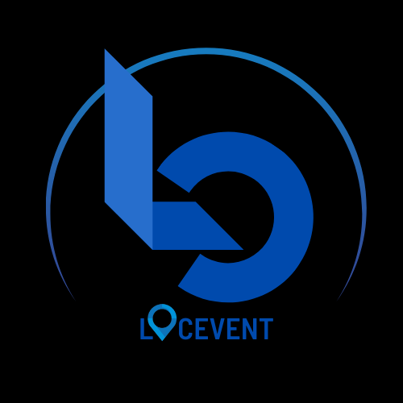

<h1 align="center">LocEvent</h1>

  

## Introduction and Background

The LocEvent app project is here to address the issue or problem that raises among local travelers or tourists those who would like to find a certain event in their current city. Based on that problem, we found our goal which is how to find events easily in their current city. Even though the goal has been found, we cannot just move towards the solution finding without doing some more research. On this progress, we follow the challange-based learning (CBL) approach that consists of three steps which are engage, investigate, and act. The engage step has been done by finding the problem earlier. Next is investigate step where we refined our challange, identify the problem/oppurunity, and create solution for the matter. By those steps, we got more refined problem which is how to help domestic traveler to find comprehensive and detailed information on nearby entertaining events. By this problem, we come in with the solution of developing an iOS app that offers an integrated, complete, and realtime information.

---

## App features

### Integrated, Complete, and Realtime Information
From the name of the event all the way to detailed information such as description, price, ETA to arrive there, etc will be provided and help users to find information that they need.

### Maps locations
Distance and ETA tend to be the main concern for event-seekers. Therefore, this feature will give them the idea on event's locations.

### Planner
We are all humans, and that's wyhy sometimes we forget about stuff, including the events we would like to attend. To anticipate this problem, we create a feature that could remind you regarding the upcoming events that you put your interest in. Just one click away and you won't miss them!

---

## Team Members:

#### Fayza Aulia
#### Gusti Ngurah Deva Wirandana Putra
#### Michel Pierce Tahya
#### Paulus Caesaris Dito Putra Hartono
#### Yohanes Deny Novandian

